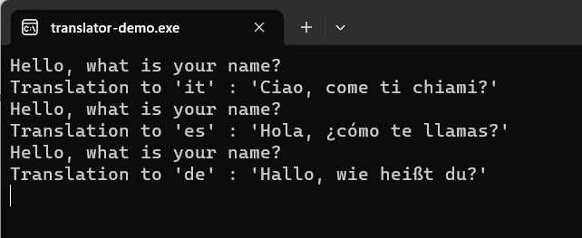

# M03 DEMO #2

- Translate Text
- Integration with Bot service

This code is provided for demo purposes only for course AI-102.

### Requirements
- Azure Subscription
- .Net core 3.1
- VS Code or VS 2019

## Translate Text

1. Open file 'translator' project and update keys with your multi-service cognitive service subscription key, endpoint and location in `appsettings.json`. Run project to get translated sentences.

## Integration with Bot service

1. The bot source code available on [repo](https://github.com/true-while/ai100-demo-bot). 

1. Configuration file `appsettings.json` should be updated with your values before publishing to the Azure Bot instance. 

1. The user sentence is translated during conversation to english and replay from bot is also translated back to the user's original language by using middleware. Conversation can be as following: 

