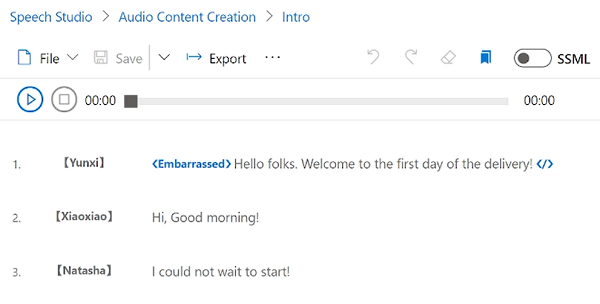

# M04 DEMO #1

- Text to Speech
- SSML

This code is provided for demo purposes only for course AI-102.

### Requirements
- Azure Subscription
- Node.js (optional)
- VS Code (optional)

## Text to Speech

1. Follow the [link](https://azure.microsoft.com/en-us/services/cognitive-services/text-to-speech/) to demonstrate text to speech capabilities by providing sample text and select voice to synthesize a speech.

1. Switch to *SSML* tab and provide content of `SSML.txt` file

## Speech Studio 

1. Build new if it does not exist cognitive multi-service in Azure portal.
 
1. Open speech portal [https://speech.microsoft.com/portal](https://speech.microsoft.com/portal) and sign in with your azure subscription account.

1. Demonstrate several voices from `Voice Gallery`. Some of the voices support emotion.

1. Switch to the Audio content creation. You can add a different voices from `Voice Gallery` and use SSML markup to manage pronunciation.

## Speaking clock (optional)

1. For successful run you need to install [SoX](https://sox.sourceforge.net/) and related NPM package.

1. The code based on the hands-on example converted to Node.js and adopted to execute on RPi. The sample is working with a microphone and expects input like 'What time is it?'

1. Original code and installation instruction can be found in following [repo](https://github.com/true-while/AI-102-AIEngineer-Nodejs)

>The sample includes Speech recognition and Speech synthesizing code examples. 

