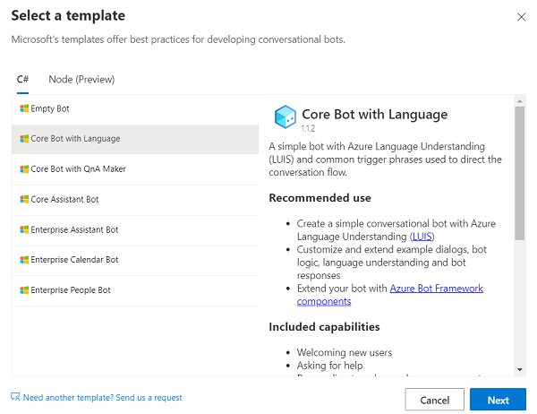
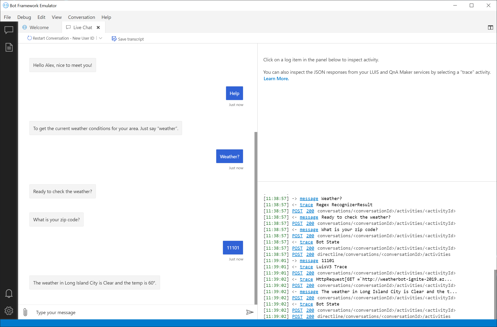

# M07 DEMO #3

- Bot Composer

This code is provided for demo purposes only for course AI-102.

### Requirements
- Azure Subscription
- [Bot Composer](https://dev.botframework.com/)

## Bot Composer

1. Download and install Bot Composer.

1. Create new Bot from composer by using template. Then publish the bot to the Azure resource according following [instruction](https://docs.microsoft.com/en-us/composer/how-to-publish-bot?tabs=v2x).

    

1. Alternately you can build bot from local folder `weatherbot`

1. You can test bot locally 

    
