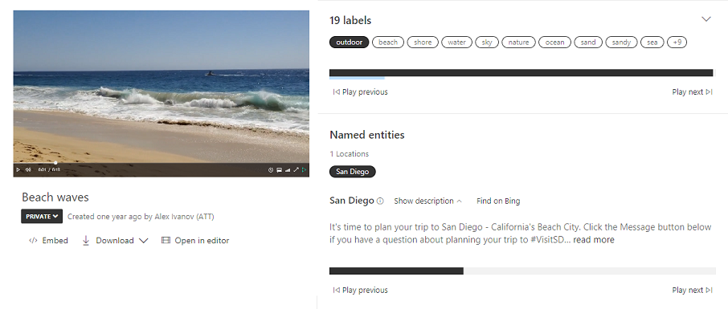
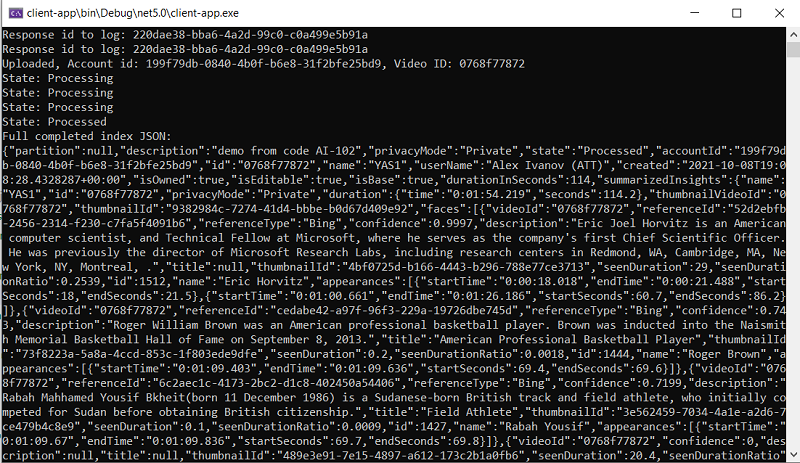

# M08 DEMO #2

- Video Analyzer

This code is provided for demo purposes only for course AI-102.

## Requirements
- Azure Subscription
- Net 5
- VS Code or VS 2019


## Video Analyzer


1. General capabilities of Video Analyzer introduced in the following [tour](https://vi.microsoft.com/en-us/tour)

1.  To index your own video you need to open the Video Analyzer portal https://www.videoindexer.ai/ and sign in with your subscription account.

1. You can upload the short video from the local folder beach-waves.mp4 and get the result of analyzing:

    - tags
    - locations
    - transcript
    - sentiment
    - key frames

    

1. You also can programmable analyze short videos by use C# code from the `client-app` folder.

1. First you need to upload a target video to the available location and provide a link. Streaming services like youtube will not work but azure storage account will work.

1. Second you need to update file `appsettings.json` with your values:

    ```json
    {
    "apiKey": "your app key can be copy from Profile page from https://aka.ms/viapi",
    "accountId": "your acc ID can be find in Account Settings in Video Analyzer portal",
    "videoUrl": "link to your video",
    "videoName": "video name"
    }

1. Finlay you can run application and observe following output

    