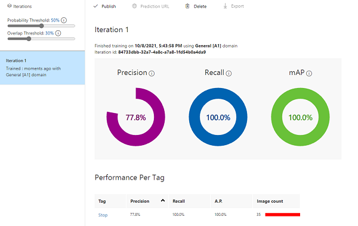

# M09 DEMO #1

- Detection Objects

This code is provided for demo purposes only for course AI-102.

### Requirements
- Azure Subscription

## Object Detection 

1. Navigate to https://www.customvision.ai/ portal and sign in with azure subscription account.

1. Follow the steps to build computer vision model form the following [tutorial](https://docs.microsoft.com/en-us/azure/cognitive-services/custom-vision-service/get-started-build-detector)

1. Build the project for object detection. The images for import you can find in the folder `Stop-Signs`

1. Train model with quick train.

    

1. You can test your model by providing street images find in internet or use local file `testing-img.jpg`.

    