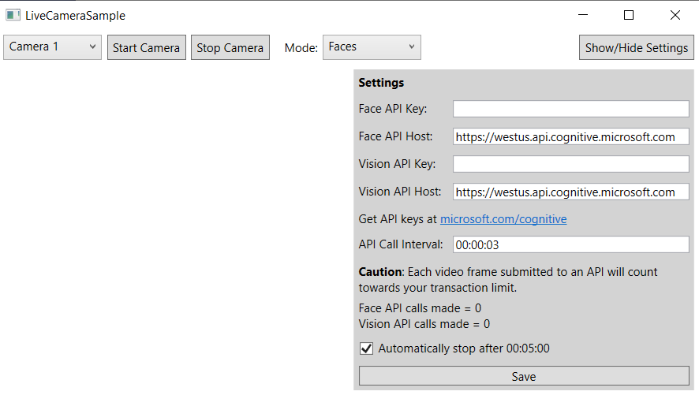
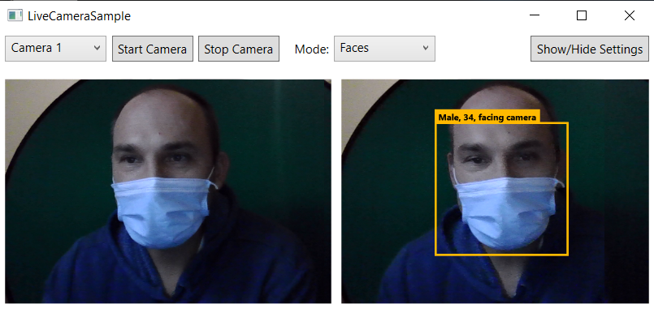
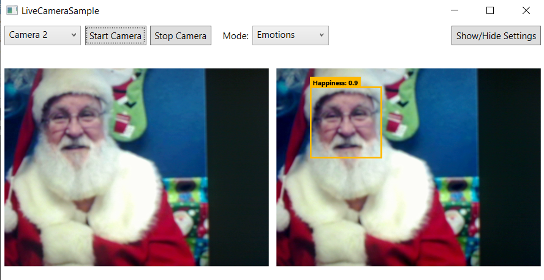
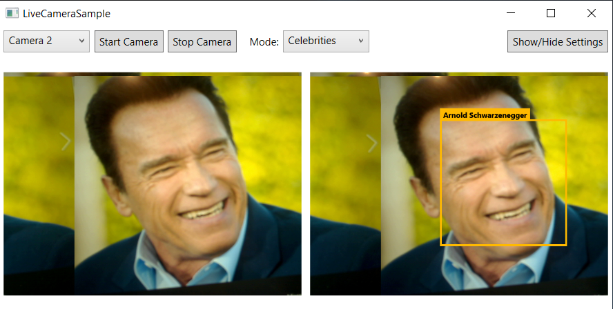

# M10 DEMO #1

- Face Detection

This code is provided for demo purposes only for course AI-102.

### Requirements
- Azure Subscription
- Visual Studio 2019 or higher
- [Windows Presentation Foundation](https://visualstudio.microsoft.com/vs/features/wpf/)

## Face Detection

1. Open solution file `FaceAnalysis.sln` in VS 2019.

1. Build and run project. The white background window appears with settings form. If the settings form is not appear by default select 'Show/Hide Settings'. Update form with your key and region of the cognitive service.

    

1. Select from `Mode` **Face** then start camera by clicking on button 'start camera'

1. Observe the result. Your face from the camera should be shown with borders and information of age and gender. Even a mask can not prevent face detection:  

   

1. You also can monitor top emotion with `Mode` **Emotion** on the face from the camera.

   

1. Another `Mode` **Celebrity** helps you to detect celebrity:

     
    
