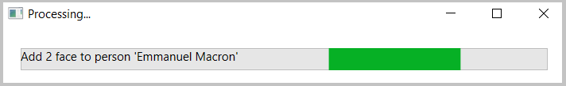
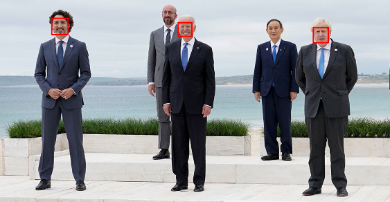
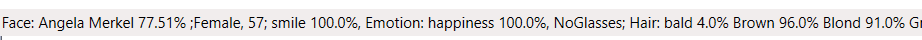

# M10 DEMO #2

- Face identification 

This code is provided for demo purposes only for course AI-102.

### Requirements
- Azure Subscription
- Visual Studio 2019 or higher
- NetFramework 4.6
- [Windows Presentation Foundation](https://visualstudio.microsoft.com/vs/features/wpf/)

## Face identification 

>Note: The code of demo is improved version of face tutorial from [repo](https://github.com/Azure-Samples/Cognitive-Face-CSharp-sample)

1. From Azure portal build Cognitive **Face API** service with **Standard** Size. Copy API Key and Endpoint values.

1. Open solution file [FaceTutorial.sln](FaceTutorial.sln) in VS 2019.

1.  Update/Create `appsettings.json` file with values copied above.

  ```json
   {
      "subscriptionKey": "",
      "faceEndpoint": ""
   }
  ```

1. Build and run project. The project includes a 5-persons face library located in the project folder. Click on the button **Load Faces** to load and train the library.

   >Note: You can modify the face library based on the context of your photos by adding or removing faces in the project folder. The images must be located in folder FaceLib folder with the person's name. eg. `FaceLib\Alex` Make sure you mark the image file as `Build action: content` and `Always copy to output`.

1. Loading and train process can take about 2 min. It is important to have the library trained. Standard tier of the Face API operates faster than free. If during the training process you get an error you should start over by closing the application.

   

1. Click the button 'Brows' to load a photo. Source code includes G7 photos for detection [g7_1.jpg](.\g7_1.jpg) and [g7_2.jpg](.\g7_2.jpg). After 10-15 seconds the faces on the images will have a red border.

   

1. To observe results of analyzing, point the mouse cursor to the red rectangle of the face. The details should be updated in the bottom status bar and tooltip

   

1. Alternatively you can demonstrate Face verification algorithm working under the hood of the face recognition on the following [tutorial](https://azure.microsoft.com/en-us/services/cognitive-services/face/)
