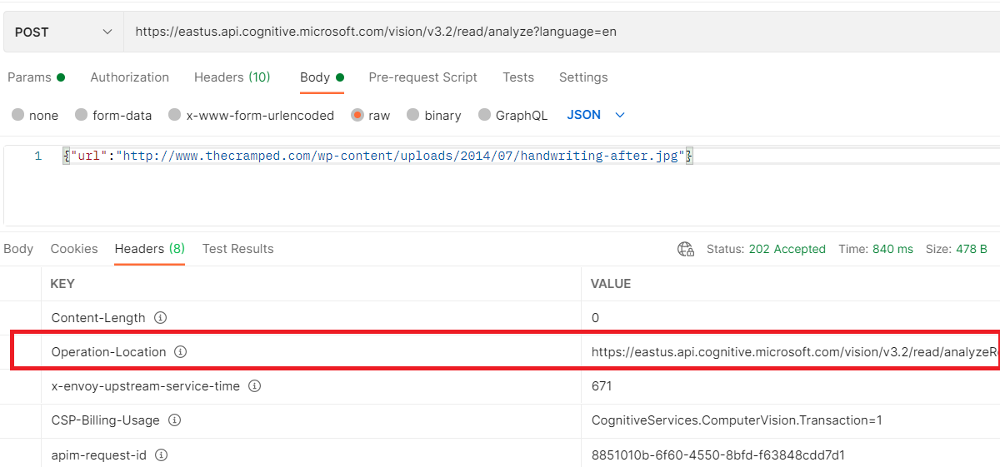
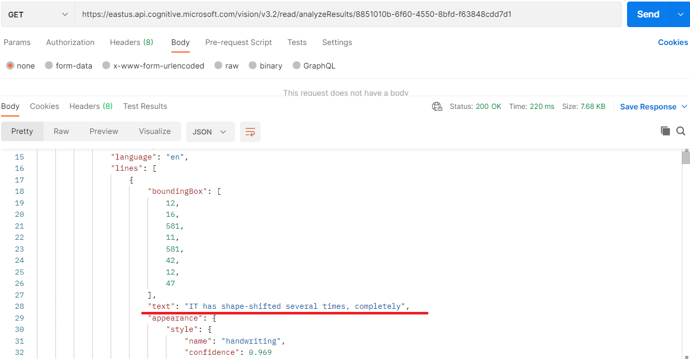

# M11 DEMO #1

- OCR and Read (Async)

This code is provided for demo purposes only for course AI-102.

### Requirements
- Azure Subscription
- [Postman](https://www.postman.com/downloads/)

## Read text from Images 

1. Create or reuse existing multi-service Cognitive service from Azure portal. Pick the key from services settings.

1. Open Postman and import collection from file `OCR.postman_collection.json` by **File>Import** menu. 

1. Test **OCR** mode by choosing `POST OCR` from the library and update `Ocp-Apim-Subscription-Key` in headers with the key you copied above. Then provide a link to the image for reading text from. The link should be updated from `Body` of request. eg [example](https://intelligentkioskstore.blob.core.windows.net/visionapi/suggestedphotos/3.png). Click `Send` button. Response should return you JSON close to following format:

    

1. Test **Read** mode by choice **POST Reading Request** from library and update `Ocp-Apim-Subscription-Key` in headers with key you copied above. Then provide a link to the image for reading text from. The link should be updated from `Body` of request. eg [example](http://www.thecramped.com/wp-content/uploads/2014/07/handwriting-after.jpg). Click `Send` button. 

   

   >Note that return body for this request can be empty

1. From the `Headers` of response above copy link from `Operation-Location`. The link should be updated in the library method GET Reading Response. The value of header `Ocp-Apim-Subscription-Key` should be updated with key value as well. Click `Send` button. Response should return you JSON close to following format:

   

    
