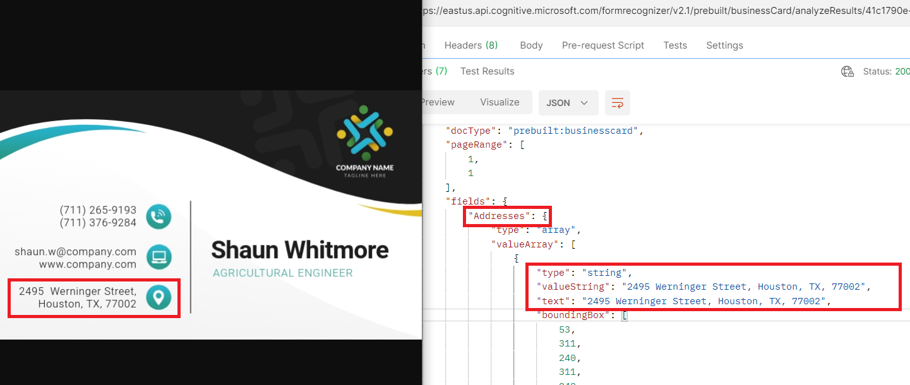
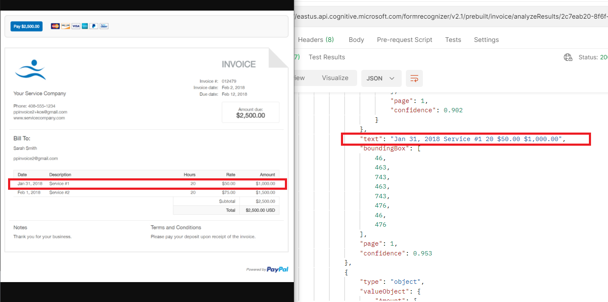
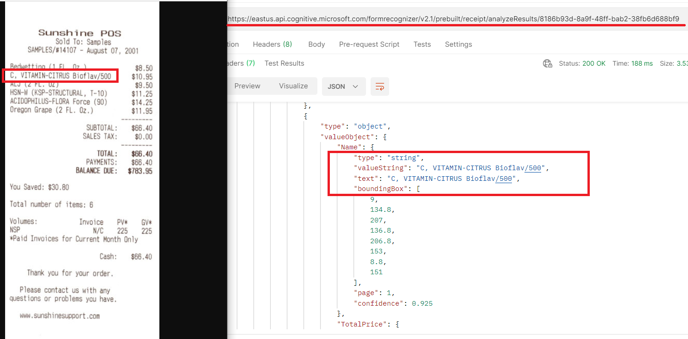

# M11 DEMO #2

- Unsupervised Form Recognizer 

This code is provided for demo purposes only for course AI-102.

### Requirements
- Azure Subscription
- [Postman](https://www.postman.com/downloads/)

## Unsupervised Form Recognizer 

1. Create or reuse existing multi-service Cognitive service from Azure portal. Pick the key from services settings.

1. Open Postman and import collection from file `FormRecognizer.postman_collection.json` by **File>Import** menu. 

1. Test **BusinessCard Request** by choosing `POST BusinessCard Request` from the library and update `Ocp-Apim-Subscription-Key` in headers with the key you copied above. Then provide a link to the image for parsing. The link should be updated from `Body` of request. eg [example](https://d1csarkz8obe9u.cloudfront.net/posterpreviews/black-and-white-business-card-design-template-492df36ff5e300196934b6a3257b42c0_screen.jpg). Click `Send` button. Response should return you JSON close to following format:

   >Note that return body for this request can be empty

1. From the `Headers` of response above copy link from `Operation-Location`. The link should be updated in the library method GET Reading Response. The value of header `Ocp-Apim-Subscription-Key` should be updated with key value as well. Click `Send` button. Response should return you JSON close to following format:
  
   

1. In the same way you can test **Invoice Request** by choosing `POST Invoice Request` from the library and update `Ocp-Apim-Subscription-Key` in headers with the key you copied above. Then provide a link to the image for parsing. The link should be updated from `Body` of request. eg [example](https://www.paypalobjects.com/digitalassets/c/okm/us/business-resource-center/images/images-for-in-body-articles/Servicing-invoice-template.jpg).

   

1. In the same way you can test **Recite Request** by choosing `POST Invoice Request` from the library and update `Ocp-Apim-Subscription-Key` in headers with the key you copied above. Then provide a link to the image for parsing. The link should be updated from `Body` of request. eg [example](https://www.sunshinesupport.com/Images/receipt_example.jpg).

   