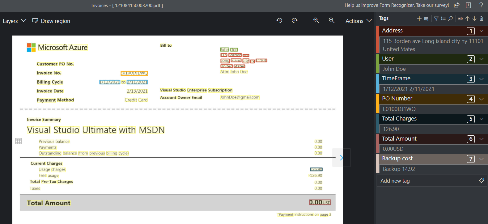
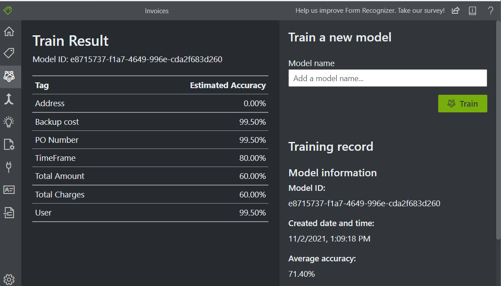
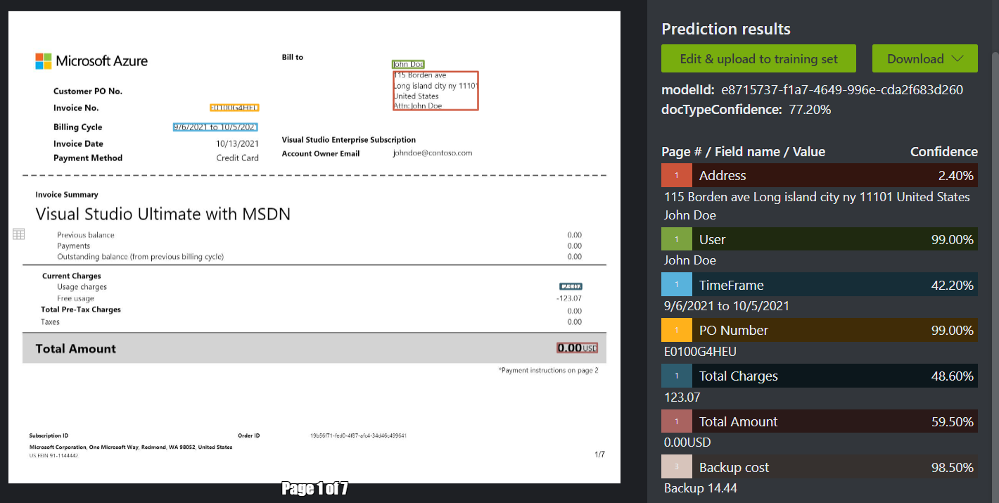
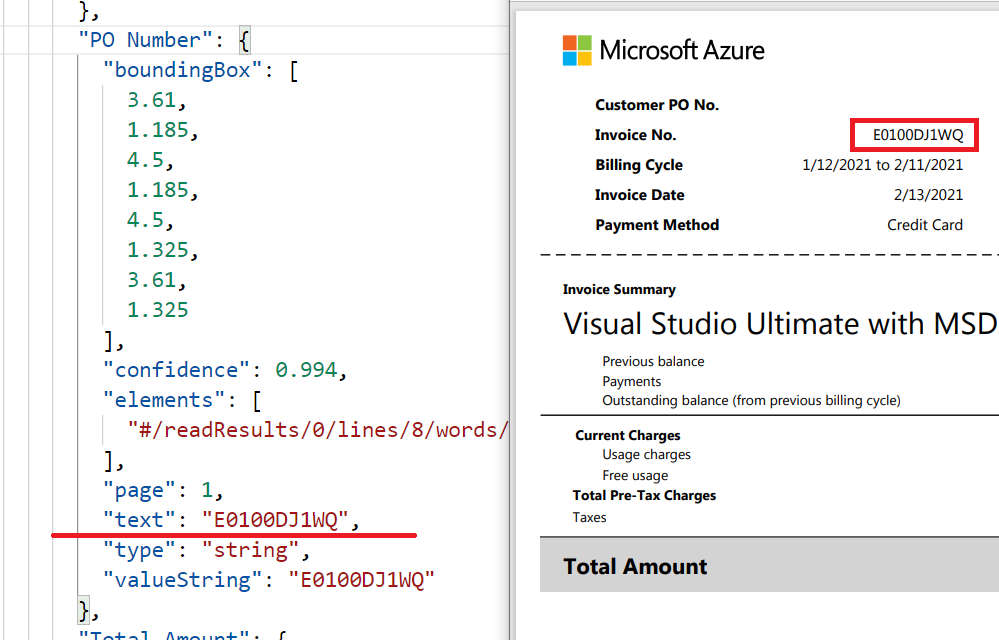

# M11 DEMO #3

- Supervised Form Recognizer 

This code is provided for demo purposes only for course AI-102.

### Requirements
- Azure Subscription
- Python

## Parsing and Train model.

1. Create a storage account and upload files from the **invoice** folder to the new container. Create a SAS for the created container. 

1. Create [Form Recognizer](https://ms.portal.azure.com/#create/Microsoft.CognitiveServicesFormRecognizer) resource and retrieve key and endpoint values 

1. Login in [Form Recognizer sample labeling tool](https://fott-2-1.azurewebsites.net/)

1. Click on `connected settings` and create connection to storage account with SAS token generated before. Details provided in the [tutorial](https://docs.microsoft.com/en-us/azure/applied-ai-services/form-recognizer/label-tool#set-up-input-data)

1. Create a new custom project to train models with labels. Provide key and endpoint you copied early

1. Click on 'Tags editor' and from apply labels to the text the details in [tutorial](https://docs.microsoft.com/en-us/azure/applied-ai-services/form-recognizer/label-tool#label-your-forms)



1. You need to have 5 documents labeled to train the model. Complete training for model as explained in [tutorial](https://docs.microsoft.com/en-us/azure/applied-ai-services/form-recognizer/label-tool#train-a-custom-model)



1. Finally analyze trained form by uploading test document [test_invoice.pdf](.\test_invoice.pdf) as explained in [tutorial](https://docs.microsoft.com/en-us/azure/applied-ai-services/form-recognizer/label-tool#analyze-a-form)



>Note that the recognizer can parse and retrieve labels from table's rows with specific name. eg. backup cost.


## Test from client (Python)

1. From the labeling tool copy Model ID from model completed above. The Model ID is located on `Train` page.

1. From Azure portal copy `endpoint` and `key` for Form Recognizer created above.

1. Update Python script with copied values as following:

```Python
   # Endpoint URL
   endpoint = ""
   # Subscription Key
   apim_key = ""
    # Model ID
   model_id = ""
```

1. Run the script by following command from terminal: 

```
   py .\analyze-81e0.py .\test_invoice.pdf -o result.json
```

1. Observe generated field  `results.json` Each filed as `PO Number` and `Address` should present on the top of the document with parsed values.

