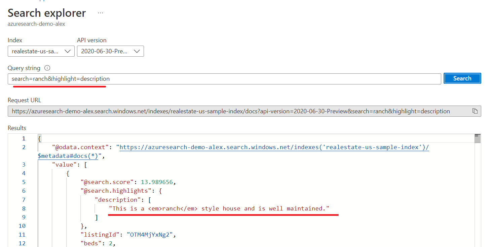

# M12 DEMO #1

- Azure Search Overview

This code is provided for demo purposes only for course AI-102.

### Requirements
- Azure Subscription

## Azure Search Overview

1. From the Azure portal create a new Cognitive Search resource. For reference you can follow the steps in [tutorial](https://docs.microsoft.com/en-us/azure/search/search-create-service-portal)

1. Open provisioned service and import sample index **realestate-us-sample**. For reference you can follow the steps in [tutorial](https://docs.microsoft.com/en-us/azure/search/search-get-started-portal)

1. Open `Search explorer` and run following queries and observe the results. Make sure you import 'realestate-us-sample' because queries is prepared for that index only.

```python
   #top 100 property in Seattle with total count calculation
   search=seattle&$count=true&$top=100

   #flats with more then 3 bedroom
   search=seattle&$filter=beds gt 3

   #cities with count of property
   search=*&facet=city&$top=2

   #bedroom with count of property
   search=seattle&facet=beds

   #highlighted search result
   search=ranch&highlight=description

   #fix typo from ranch
   search=ronch~&queryType=full

   #property in 5km from Redmond
   search=*&$count=true&$filter=geo.distance(location,geography'POINT(-122.121513 47.673988)') le 5
```



    
