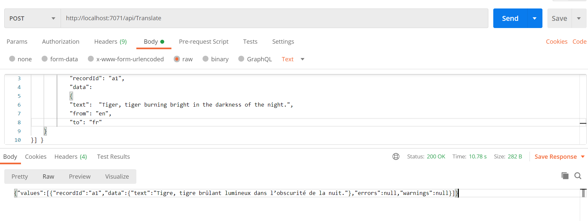
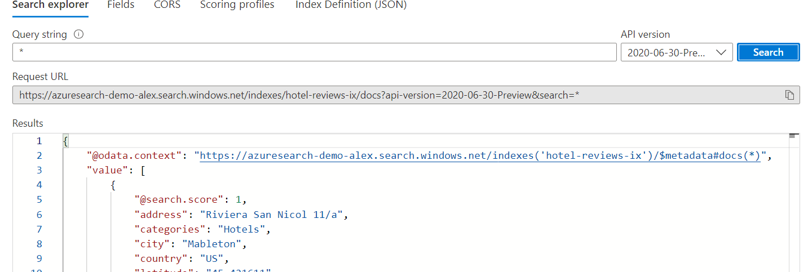
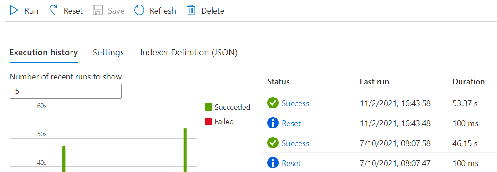
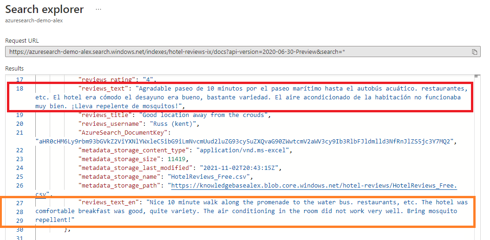

# M12 DEMO #2

- Custom Skill for Azure Search

This code is provided for demo purposes only for course AI-102.

### Requirements
- Azure Subscription
- Visual Studio Code or VS 2019
- .Net Core

## Building Custom Skill for Azure Search

1. From the Azure portal create a new Cognitive Service Translator and pick the endpoint address and keys.

1. Create a new Function on azure portal or use Visual Studio Code to create and deploy HTTP triggered functions. Refer to the following [tutorial](https://docs.microsoft.com/en-us/azure/azure-functions/create-first-function-vs-code-csharp?tabs=in-process&pivots=programming-runtime-functions-v3) for details. 

1. In folder `TranslateFunction` you can find a demo project for deployment. Update `TranslateFunction.cs` the following values with your Translator service.

   ```csharp
      static string CognitiveServicesTokenUri = "https://<your-service-name>.cognitiveservices.azure.com/sts/v1.0/issuetoken";
      static string SubscriptionKey = "<your key>";
   ```

1. Publish and test your function. Make sure that translation is working as expected. You can use following JSON as body for test:

      ```JSON
      {"values": [
            {
                  "recordId": "a1",
                  "data":
                  {
                  "text":  "Tiger, tiger burning bright in the darkness of the night.",
                  "from": "en",
                  "to": "fr"
         }
      }] }
      ```

   

1. Create or reuse a new storage account. Create container `reviews` and upload file `HotelReviews_Free.csv` in it.

1. Create or reuse existing Azure Cognitive Search. Register new `Data Source` from the file you uploaded in the storage account above.

1. Click on 'Import' on top to start importing wizard. Some details you can find in [doc](https://docs.microsoft.com/en-us/azure/search/search-import-data-portal#starting-the-wizard).

1. When the index build you can open `Search explorer` and run a few queries to check if review content can be retrieved.

   

1. Now you need to add your function to `custom skills` update skill's JSON as explained in [tutorial](https://docs.microsoft.com/en-us/azure/search/cognitive-search-create-custom-skill-example#connect-to-your-pipeline). Example of the custom skill modification

   ```JSON
   {
         "@odata.type": "#Microsoft.Skills.Custom.WebApiSkill",
         "name": "custom translate to italian",
         "description": "translate description on italian by use custom skill",
         "context": "/document",
         "uri": "https://funazuretranslate.azurewebsites.net/api/Translate?to=en&code=<YOUR CODE>",
         "httpMethod": "POST",
         "timeout": "PT30S",
         "batchSize": 1,
         "degreeOfParallelism": 20,
         "inputs": [
         {
            "name": "text",
            "source": "/document/reviews_text"
         },
         {
            "name": "from",
            "source": "/document/Language"
         }
         ],
         "outputs": [
         {
            "name": "text",
            "targetName": "reviews_text_en"
         }
         ],
         "httpHeaders": {}
      }
   ```

1. Now you need to create a new field with name `reviews_text_en` referenced in skill. First you need to update `indexer definition JSON` with new output like following:

      ```JSON
      "outputFieldMappings": [
         {
            "sourceFieldName": "/document/reviews_text_en",
            "targetFieldName": "reviews_text_en"
         }
      ],
      ```
1. Second add new field in `index definition JSON` like following:

   ```JSON
   fields [
      ...
      {
         "name": "reviews_text_en",
         "type": "Edm.String",
         "facetable": false,
         "filterable": false,
         "key": false,
         "retrievable": true,
         "searchable": false,
         "sortable": false,
         "analyzer": null,
         "indexAnalyzer": null,
         "searchAnalyzer": null,
         "synonymMaps": [],
         "fields": []
      },
      ...
   ```

1. Finally you need to `reset` and `run` again the indexer. It should be successful. It is important to copalite `reset` before start a new `run`

   

1. Next request in `Search explorer` should return you back the reviews with english translation.

   