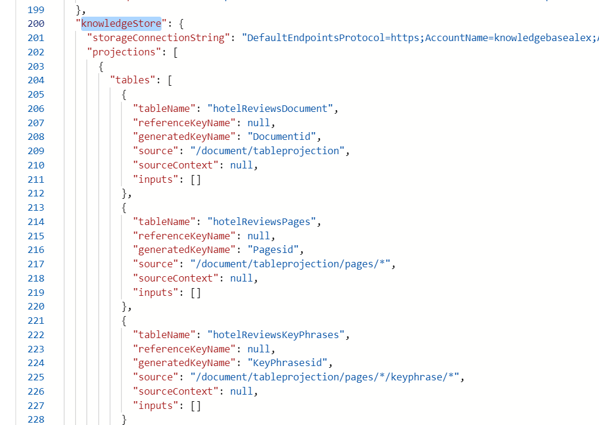
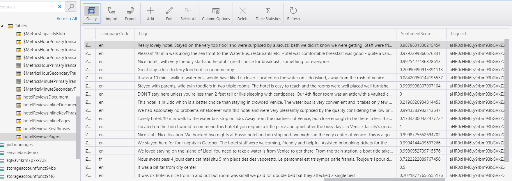

# M12 DEMO #3

- Knowledge Store

This code is provided for demo purposes only for course AI-102.

### Requirements
- Azure Subscription
- Visual Studio Code or VS 2019
- .Net Core

## Adding Text Analyzing service and Build Knowledge Store

1. From the Azure portal open Index to created in previous demo.

1. Add existed multi-service cognitive service or build new one.

1. Add following skills to the skillset and rerun Indexer. You can refer to the example file (skillset.json)[skillset.json]. You also can refer to the following [tutorial](https://docs.microsoft.com/en-us/azure/search/knowledge-store-create-rest) for details. 

1. From the skill definition add new `ShaperSkill` as explanted in [tutorial](https://docs.microsoft.com/en-us/azure/search/knowledge-store-create-rest#create-a-skillset)

1. Rerun indexer and query the service for reviews. Text Analyzing skills can generate following output.

   

1. Provide location for `Knowledge Store` by linking your storage account. 

   

1. At the end of the skillset JSON you can find reference to the storage account and different type of objects from projections.

   

1. Rerun indexer and check if the storage account tables contains the required records. Each record correspond to the review record.  

   

