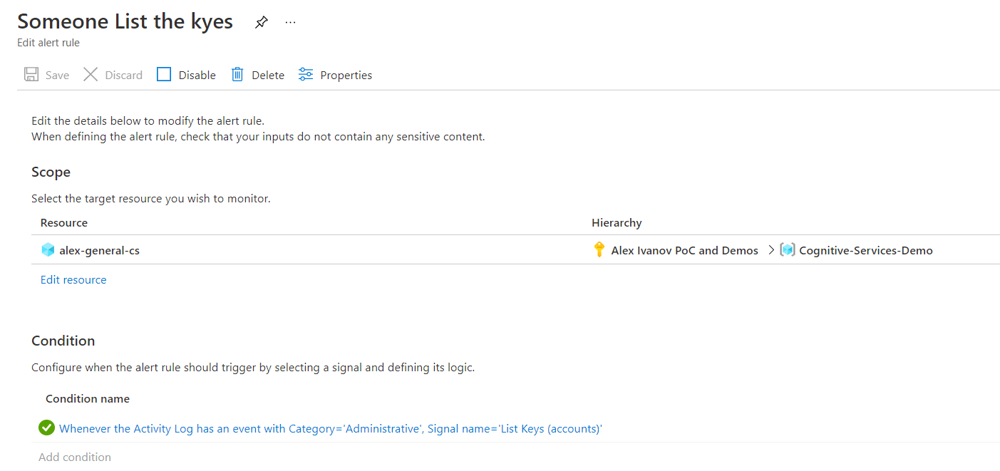
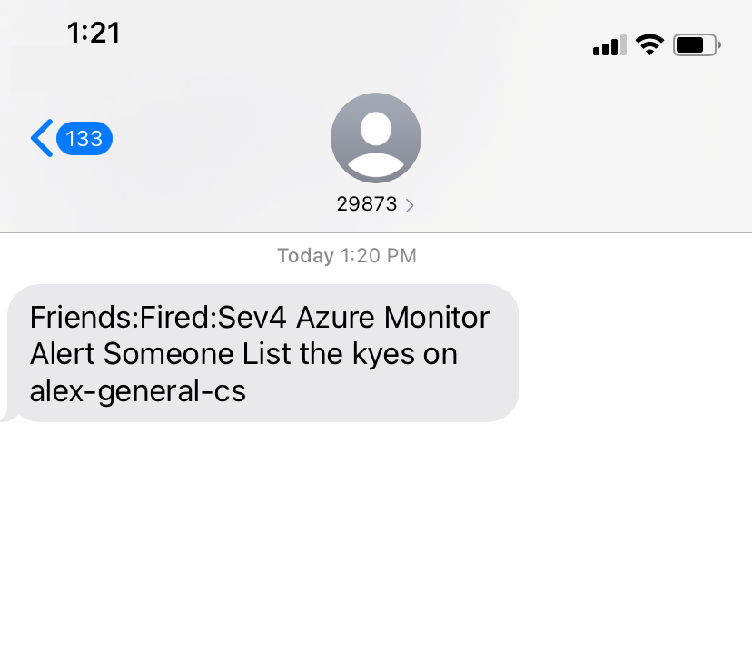

# M02 DEMO #3

- Azure Monitor
- Azure Alerts

This code is provided for demo purposes only for course AI-102.

### Requirements
- Azure Subscription
- Cell number for SMS delivery

## Azure Monitor

1. Open Azure portal

1. Find provisioned before cognitive service. To demonstrate activities it is better to use service provisioned and requested before in the demos. Open Azure Monitor of the service explained in following [QuickStart](https://docs.microsoft.com/en-us/azure/search/search-monitor-usage)

1. On the Metics dialog add chart for "Successful Calls" and "Client Error" or eg. "Computer Vision Transactions"

1. On the Cognitive service find "Activity Log" and observe activities such as Listing Keys and Regenerating keys. You can retrieve the keys or regenerate it to get activities in the list. 

## Azure Alerts

1. Open Azure portal

1. Find provisioned before cognitive service.

1. Select "Alerts" from the blade to build new alert.

1. For condition setup `activity log` type of activity `Administrator activity`. Activity name eg `Regenerate keys`. Minimize all time values to get alerted quicker.

1. Build a new Action group and add your cell phone number to receive SMS. 

1. Save the alert.

1. To trigger alert execute activity on the service you set up for then open the alerts again. It takes about 1-2 min to get the alert triggered. Alerted activity should come in the list of alerts.

1. Your cell phone should receive alert message

