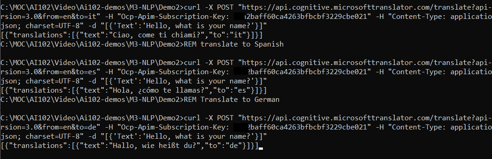
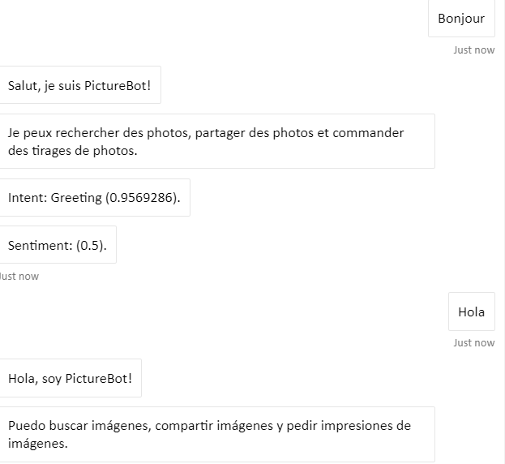

# M03 DEMO #2

- Translate Text
- Integration with Bot service

This code is provided for demo purpose only for course AI-102.

### Requirements
- Azure Subscription

## Translate Text

1. Open file 'translate.bat' and update command with your multi-service cognitive service subscription key. The value should follow `Ocp-Apim-Subscription-Key:` without quotes. The origin language is English and translation will be provided in the short name of the language in "to" parameter.

## Integration with Bot service

1. The bot source code available on [repo](https://github.com/true-while/ai100-demo-bot). 

1. Configuration file `appsettings.json` should be updated with your values before publishing to the Azure Bot instance. 

1. The user sentence is translated during conversation to english and replay from bot is also translated back to the user's original language by using middleware. Conversation can be as following: 

