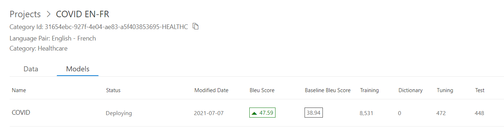

# M03 DEMO #3

- Custom Translator

This code is provided for demo purpose only for course AI-102.

### Requirements
- Azure Subscription
- Cognitive Services: Translator
- [Postman tool](https://www.postman.com/downloads/)

## Custom Translator

1. Find or Build new `Cognitive services: Translator` to copy Key and region from it.

1. Open custom translator [portal](https://portal.customtranslator.azure.ai/) and sign in with your azure subscription account.

1. Create new project named `COVID` with `language Pair` *English to French* and `Category` *Healthcare*

1. Upload documents by providing parallel pairs in English and French. Documents with the same content and name can be found in folder [EN](./EN) and [FR](./FR). Each uploaded pair will give you a number of `English Sentences`	and `French Sentences`. You have to upload documents for at least 10k of sentences in the target language.

    
  
1. When you click on the document name in the list you can observe EN and FR sentences and check the translation. 

    

1. Start training process and be aware that each training will consume credits from your subscription.

1. Publish your model and copy the model's Category ID.

    

1. Open file [translator.postman_collection.json](./translator.postman_collection.json) and update *subscription* and *region* of all requests according to the key of your translation service. Then update *category id* with the value you copied from the custom translator.

1. Import file `translator.postman_collection.json` in postman. Execute queries one by one and compare a result of translation. 

    

>For testing sentences you can use files from [Test](./Test) folder.

