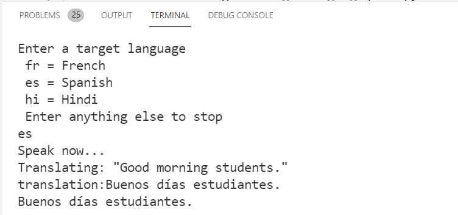

# M04 DEMO #3

- Synthesizing Translations

This code is provided for demo purpose only for course AI-102.

### Requirements
- Azure Subscription
- Node.js
- VS code

## Synthesizing Translations

1. The code based on the hands-on example converted to Node.js and adopted to execute on RPi. The sample is working with a microphone and expects input from the microphone of any sentence and translates it to one of the selected languages while synthesizing the speech.

1. Original code and installation instruction can be found in following [repo](https://github.com/true-while/AI-102-AIEngineer-Nodejs)

>The sample includes Speech recognition and Speech synthesizing code examples. 

