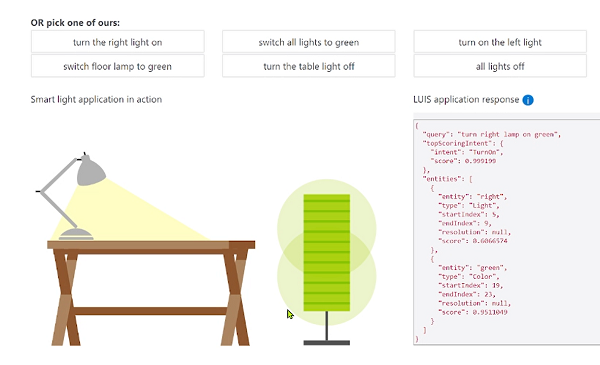
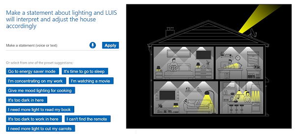

# M05 DEMO #1

- LU introduction

This code is provided for demo purposes only for course AI-102.

### Requirements
- Azure Subscription

## LU introduction

1. Follow the link to play with web integrated [example]https://azure.microsoft.com/en-us/services/cognitive-services/language-understanding-intelligent-service/). You can use already provided commands to turn on/of light on laps including switch to green light. This demo use already pre-trained LU model which you can not modify yet.

  

1. Another example has a more sophisticated model of intelligent house management system you can find on the following [link](https://aidemos.microsoft.com/luis/demo). You also can run excited samples and also leverage the microphone.

  

